#  Burrow

Deep clean and optimize your Mac: free disk space, remove apps completely, keep apps up to date, clean browsers and check how your Mac is doing.

## Setup

Burrow runs on the Python that comes with Apple's Command Line Tools. If your Mac doesn't have them, Burrow shows how to install them: press <kbd>↩</kbd> to copy `xcode-select --install`, paste it in Terminal and follow Apple's window.

Optional tools, which Burrow uses when they're installed:

* [mas](https://github.com/mas-cli/mas) (`brew install mas`) to update App Store apps from Burrow.
* [Homebrew](https://brew.sh) to update apps installed with `brew install --cask`, and for the Homebrew tasks in Optimize.

## Usage

See every command via the `burrow` keyword. Every keyword can be changed in the [Workflow’s Configuration](https://www.alfredapp.com/help/workflows/user-configuration/).

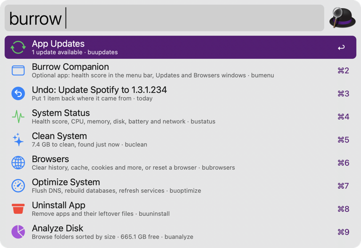

Nothing Burrow removes is deleted outright: it all goes to the Trash. **Undo** in `burrow` puts back the last thing Burrow moved to the Trash, and the one before that. **Empty Trash** frees the space when you're ready.

### Keys

The same key means the same thing wherever a row supports it:

* <kbd>↩</kbd> Run the row's action. Anything that removes files asks first.
* <kbd>⌘</kbd><kbd>↩</kbd> Reveal in Finder.
* <kbd>⌥</kbd><kbd>↩</kbd> Move to the Trash. In Uninstall, uninstall straight away. In Duplicates, keep the newest copy.
* <kbd>⌃</kbd><kbd>↩</kbd> Copy the path. In Clean, never clean this item.
* <kbd>⌘</kbd><kbd>C</kbd> Copy. <kbd>⌘</kbd><kbd>L</kbd> Show in Large Type. <kbd>⇧</kbd> Quick Look.

Actions on everything (Clean All, Purge All, Keep Newest of Each…) are on the summary row at the top.

### System Status

See the health score, CPU, GPU, temperatures, fans, memory, disks, battery, power, network and top processes via the `bustatus` keyword. It refreshes while open.

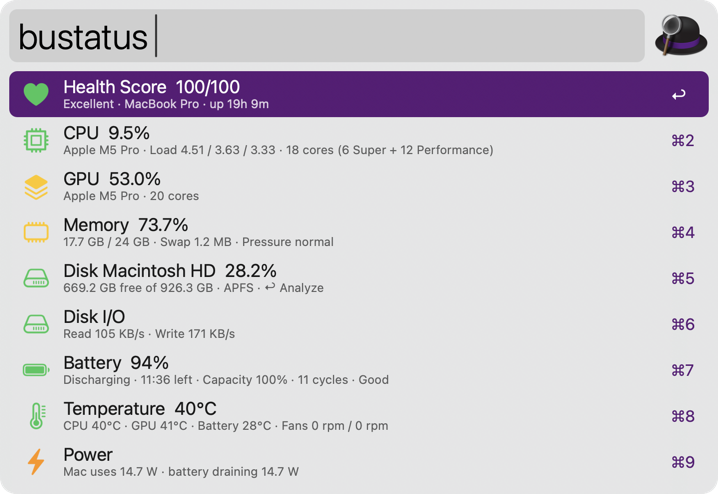

### Clean System

Find app, browser, developer and system caches, logs, crash reports and old temporary files via the `buclean` keyword.

* Caches of apps that are open are skipped. Burrow lists them; quit them and rescan to include them.
* Anything owned by macOS, plus Mail, Messages and Safari data, is left alone.
* Optional items (iPhone update files, device backups, Xcode archives) are listed but never included in **Clean All**.

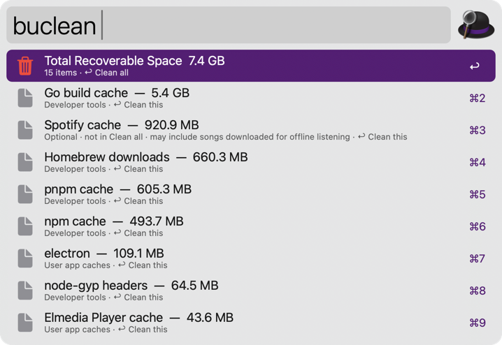

### Uninstall App

Remove an app and everything it left behind via the `buuninstall` keyword, or via the **Uninstall with Burrow** [File Action](https://www.alfredapp.com/help/features/file-search/#file-actions). Type `unused`, `big` or `leftovers` to filter.

<kbd>↩</kbd> reviews the app first: every leftover (🔒 marks system-owned ones), system extensions, and the developer's own uninstaller if it ships one. Press <kbd>↩</kbd> on a leftover to keep it. Then choose **Uninstall Completely**, or **Reset** to keep the app and wipe its settings.

A complete uninstall removes:

* The app, which is quit first and taken out of the Dock.
* Its launch agents and daemons.
* Preferences, Application Support, Caches, Containers, Saved State, HTTP storage, WebKit data, cookies and logs.
* Shared folders it declares in its signature, unless another app from the same developer still uses them.
* Hidden caches under `/var/folders`, crash reports, installer-added helpers and plug-ins, and receipts.
* Homebrew's record of the app, when it came from `brew install --cask`.

System-owned items need your password, which macOS asks for once. The whole uninstall is one Undo step. Apps with system extensions (VPNs, firewalls, antivirus) are flagged: macOS only removes those in **System Settings → Login Items & Extensions** or with the developer's uninstaller.

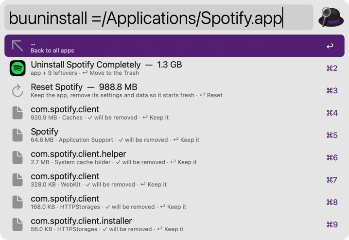

### App Updates

Check every app for a newer version via the `buupdates` keyword.

| Source | Apps | How it installs |
|---|---|---|
| Mac App Store | App Store apps | With [mas](https://github.com/mas-cli/mas), when installed. Otherwise the App Store opens |
| Homebrew | Apps installed with `brew install --cask` | `brew upgrade --cask` |
| Sparkle | Apps with a built-in “Check for Updates…” | Burrow downloads and installs it |
| Electron | Apps using electron-updater | Burrow downloads and installs it |
| Homebrew catalog | Other apps Homebrew knows about | Burrow downloads and installs it |

Before installing, Burrow checks the download is served over HTTPS, is the same app (bundle ID), has a valid signature from the same developer (Team ID), passes Gatekeeper if the current version does, is newer, and runs on your Mac. If any check fails, nothing changes. The old version goes to the Trash, so Undo rolls the update back.

* <kbd>↩</kbd> Update.
* <kbd>⌘</kbd><kbd>↩</kbd> Release notes.
* <kbd>⌥</kbd><kbd>↩</kbd> Skip this version.
* <kbd>⌃</kbd><kbd>↩</kbd> Never check this app.

Apps with their own updaters (Microsoft, Google Chrome, Adobe, JetBrains, Setapp) are left to them. Set **Automatic Update Checks** in the Workflow’s Configuration to get a daily notification, or to also install verified updates for apps that aren't open (App Store and Homebrew updates are only notified).

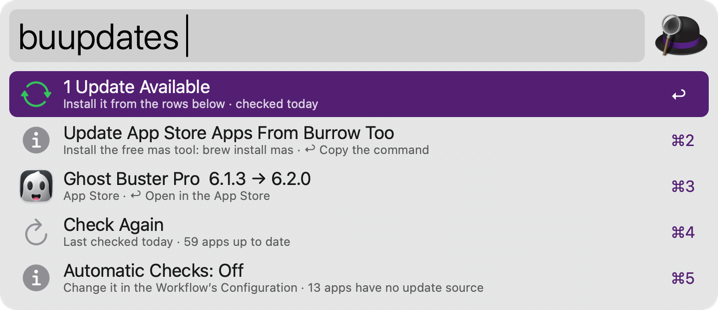

### Browsers

Clean or reset every installed browser via the `bubrowsers` keyword: Safari, Chrome, Brave, Edge, Opera, Vivaldi, Arc, Dia, Comet, Helium, Sigma, Orion, Firefox, LibreWolf, Floorp, Zen, Tor Browser and others built on Chromium, Firefox or WebKit.

<kbd>↩</kbd> on a browser chooses what to clean and the time range:

* Cache, and open tabs and sessions (always cleared completely).
* Browsing history. Bookmarks are never touched.
* Download history. The downloaded files stay.
* Cookies and site data. This signs you out of websites.
* Saved form data. Addresses and cards are kept.
* Saved passwords, after a second confirmation.

**Reset Settings** restores the browser's defaults and keeps bookmarks, history and passwords. In Chromium browsers, extensions and their data move to the Trash with the old settings. **Full Reset** moves the whole profile to the Trash.

The browser is quit first, if you agree. Databases that are only partly cleaned are backed up to the Trash first, so Undo restores them. With sync on, deleted items may come back from your account.

* <kbd>⌥</kbd><kbd>↩</kbd> Clean now with your saved choices.
* <kbd>⌘</kbd><kbd>↩</kbd> Reveal the browser's data folder.
* <kbd>⌃</kbd><kbd>↩</kbd> Copy its path.

Safari's data is protected by macOS. To clean it, give Alfred **Full Disk Access** in **System Settings → Privacy & Security**.

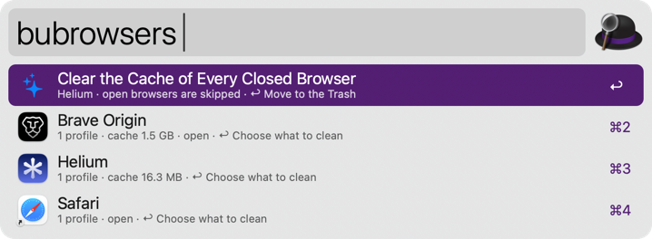

### Processes

See what's using your Mac's CPU and memory via the `bukill` keyword. CPU is measured over the last moment, like Activity Monitor. Each app's helper processes are grouped under it, and copies of one program share a row. Type part of a name, a PID, or a path containing `/` to filter.

* <kbd>↩</kbd> Quit an app the normal way, so it can ask to save. Other processes are asked to end.
* <kbd>⌥</kbd><kbd>↩</kbd> Force quit. Unsaved changes are lost, so Burrow asks first (you can turn that off in the Workflow’s Configuration).
* <kbd>fn</kbd><kbd>↩</kbd> Restart an app.
* <kbd>⌘</kbd><kbd>↩</kbd> Reveal in Finder. <kbd>⌃</kbd><kbd>↩</kbd> Copy the path. <kbd>⌘</kbd><kbd>L</kbd> Show its PIDs.
* On the top row, <kbd>↩</kbd> sorts by CPU or memory and <kbd>⌥</kbd><kbd>↩</kbd> groups or ungroups helper processes.

**Quit All Apps** on the top row quits every open app normally, so apps with unsaved changes can ask you to save.

* <kbd>↩</kbd> Quit all apps.
* <kbd>⌥</kbd><kbd>↩</kbd> Quit all except the app you're using.

Finder, Alfred and Burrow Companion always stay open. Add more under **Quit All Exclusions** in the Workflow’s Configuration (app names or bundle IDs, comma-separated). Burrow tells you which apps are still open afterwards.

See which program holds a port via the `bukill` keyword followed by `:` (or `ports`), or type a port number. Each row shows the address and the program behind it.

* <kbd>↩</kbd> End the program. <kbd>⌥</kbd><kbd>↩</kbd> Force quit it.
* <kbd>fn</kbd><kbd>↩</kbd> Open `http://localhost:PORT` in your browser.
* <kbd>⌘</kbd><kbd>↩</kbd> Reveal the program in Finder. <kbd>⌃</kbd><kbd>↩</kbd> Copy the PID. <kbd>⌘</kbd><kbd>C</kbd> Copy `localhost:PORT`.

macOS only shows you your own programs' ports; press <kbd>↩</kbd> on the top row to see every user's, which asks for your password (or Touch ID). Ports held by parts of macOS, such as AirPlay's 5000 and 7000, are marked ⚠️ and ask before ending.

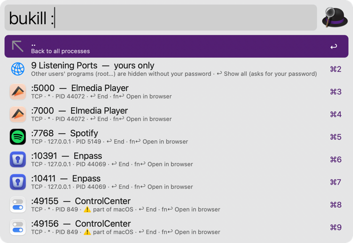

Processes owned by another user (🔒) ask for your password through the standard macOS prompt. Parts of macOS whose ending would log you out or freeze the Mac (⚠️) get a warning first. If a process has already exited and its PID was reused, Burrow leaves the new process alone.

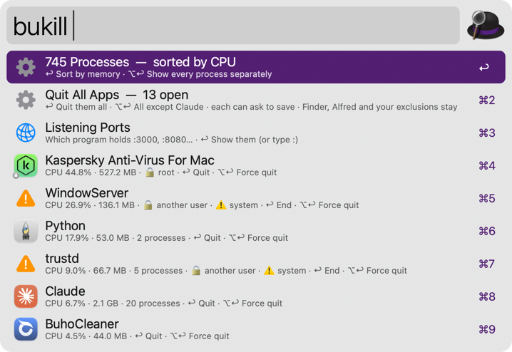

### More Commands

* `buoptimize` Flush DNS, free memory, rebuild Launch Services, reset Quick Look and font caches. Homebrew, Docker and simulator tasks appear when those are installed.
* `buanalyze` Browse folders sorted by size, or via the **Analyze with Burrow** File Action. <kbd>⇥</kbd> or <kbd>↩</kbd> opens a folder.
* `bularge` Find big files, with when they were last opened. Filter with `2gb`, `video`, `audio`, `image`, `archive`, `disk` or `old`.
* `budupes` Find identical files in Downloads, Desktop, Documents, Movies, Music and Pictures, or any folder you type, or via the **Find Duplicates with Burrow** File Action.
* `bustartup` List launch agents and daemons, and remove ones left behind by deleted apps.
* `bupurge` Find `node_modules`, `dist`, `target`, `venv`, `Pods` and similar folders in projects you haven't touched lately. A folder only counts when its project file proves what it is (for example `dist` needs a `package.json`).
* `buinstallers` Find `.dmg`, `.pkg` and `.iso` files.
* `butouchid` Turn Touch ID for `sudo` on or off. When it's on, Burrow uses Touch ID for its own administrator prompts too (removing system files, root-owned apps, other users' processes). macOS's standard prompt only offers Touch ID to Apple's own apps, so without it Burrow asks for your password.
* `bumenu` Open Burrow Companion (below).

Open any command from other apps and scripts with `alfred://runtrigger/io.github.burrow-alfred/open/?argument=clean` (or `status`, `updates`, …).

### Burrow Companion (Optional)

Burrow Companion is a separate app that shows the health score in the menu bar, and opens App Updates, Browsers and the Uninstaller in a window. The Uninstaller lists every app with its size and last use (filter by Unused or Largest), shows everything an app installed with a checkbox to keep any item, and uninstalls or resets it with Undo. Burrow works fully without it.

Download `Burrow-Companion.zip` from the [latest release](https://github.com/x-o-r-r-o/burrow/releases/latest) and move the app to Applications. It isn't notarized by Apple, so the first time, open it, then click **Open Anyway** in **System Settings → Privacy & Security**.

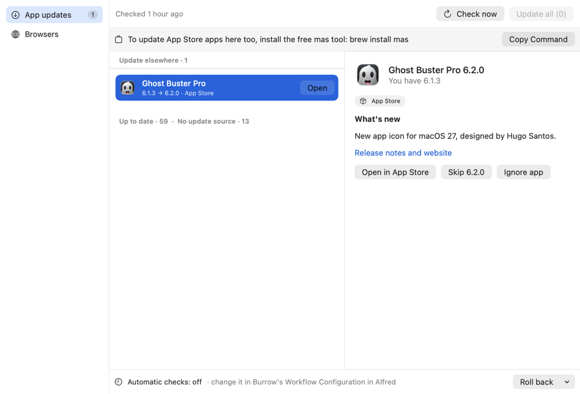

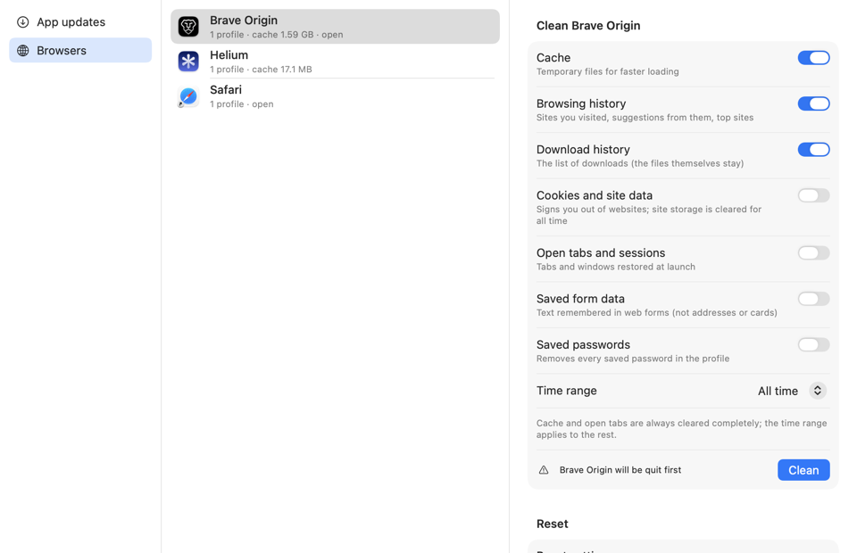

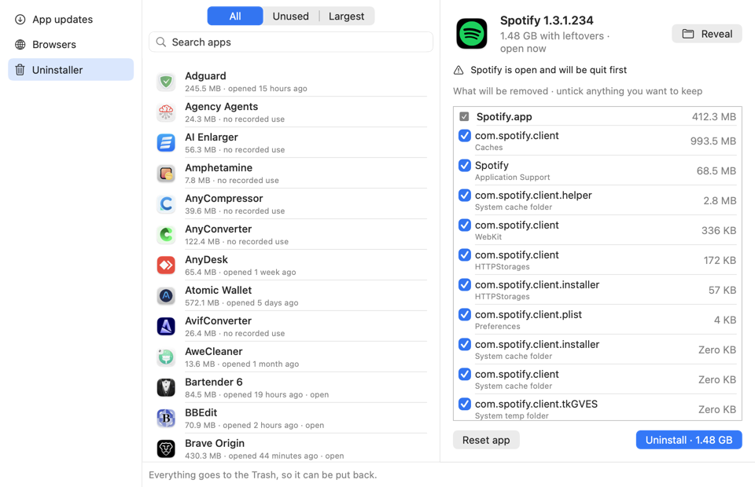

## Privacy

Burrow works on your Mac and has no analytics. It only goes online for app updates: it checks the App Store (`itunes.apple.com`), Homebrew (`formulae.brew.sh`), GitHub (for Electron apps) and each app's own update feed, and downloads updates from where each app publishes them.

## Credits

Burrow's design started as a port of the Raycast “Mole” extension by jlrochin and adria_navarrete (MIT License). Burrow was written with the help of Claude, an AI assistant by Anthropic.
